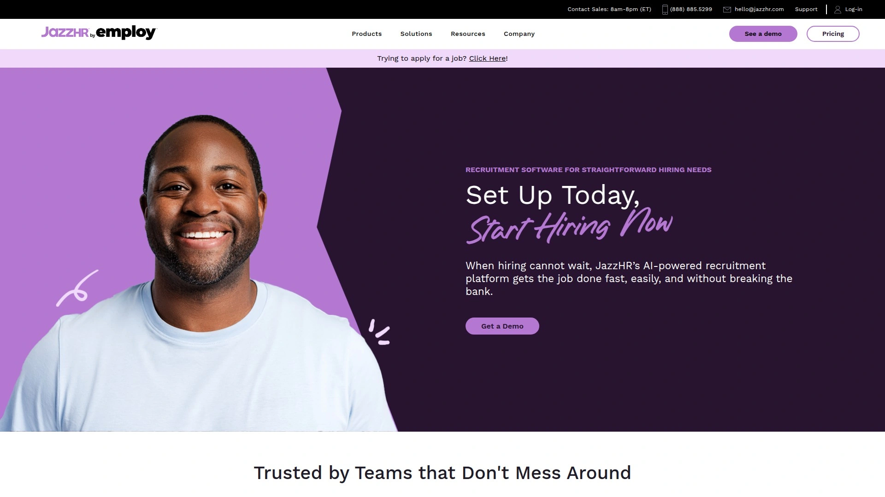
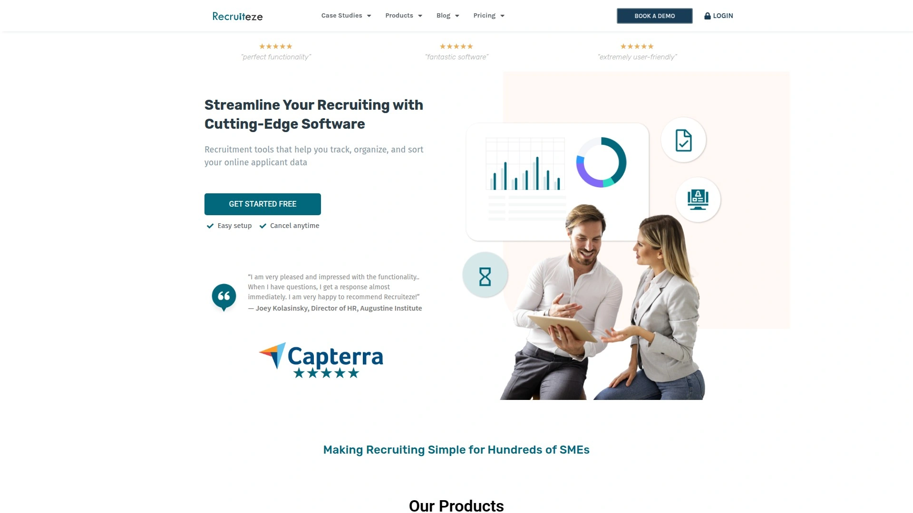

# Top 25 Recruiting Software Platforms Ranked in 2025 (Latest Compilation)

Hiring shouldn’t feel like herding cats. If you’re tired of juggling spreadsheets and email threads just to fill a role, **recruiting software** can be a game-changer. These platforms (often called **Applicant Tracking Systems (ATS)**) streamline the hiring process – from posting jobs to tracking candidates – saving you time and headaches. In this roundup, we tackle the core pain points of modern recruiting (organization, speed, collaboration) and promise tools that deliver faster hiring, better candidate experiences, and more efficient workflows for teams of all sizes. Let’s dive in and find your next hiring sidekick!

## [Breezy HR](https://breezy.hr)
*Modern hiring software with end-to-end automation, perfect for scaling SMB teams.*

Breezy HR turns tedious hiring tasks into a *breeze* (pun intended). It advertises your jobs across **50+ job boards with one click**, so quality candidates roll in without manual posting marathons. Once applications flow, Breezy’s **visual pipeline** lets you drag-and-drop candidates through stages, giving you an instant snapshot of your hiring funnel. Key features include:

- **Automation galore:** It automates pre-screening questionnaires, interview scheduling, and even personalized email templates, freeing you from repetitive admin work.
- **Team collaboration:** Hiring is a team sport in Breezy – share candidate feedback, @mention teammates, and keep everyone in the loop with ease.
- **Candidate experience:** A customizable careers page and SMS messaging keep applicants engaged. Breezy also integrates with background check and HRIS tools, ensuring a smooth journey from offer to onboarding.

**Why we recommend it:** Breezy HR is incredibly **user-friendly** for non-techies and offers a **14-day free trial** with no credit card needed, lowering the adoption barrier. If you’re a small or mid-sized business looking to level-up your hiring process without a steep learning curve, Breezy’s balanced mix of power and simplicity makes it our top pick.

## [Workable](https://www.workable.com)
*Collaborative recruiting platform with AI sourcing and one-click job posting for broad reach.*

Workable is a veteran in the recruiting software space and lives up to its name by being highly *workable* for teams. It provides a full-suite **ATS plus HR tools**, but its shining star is a massive job board network – you can blast your opening to 200+ job sites effortlessly. Workable’s built-in AI helps source candidates too, suggesting top talent from its database to match your job description.

Hiring teams love Workable for its **collaborative features**: you can assign roles (hiring manager, recruiter, etc.), gather structured feedback through scorecards, and even launch one-click video interviews. The interface is intuitive, with **drag-and-drop pipelines**, and analytics dashboards that show metrics like time-to-hire and source quality.

Onboarding Workable is straightforward – they offer plenty of tutorials and a helpful support team. Pricing is flexible (monthly plans based on number of job openings), making it accessible whether you’re hiring for 2 roles or 200. **Bottom line:** If you want a widely trusted platform that combines ease of use with advanced functionality (and don’t mind a slightly higher price for it), Workable is a robust choice for both startups and global companies.

## [Greenhouse](https://www.greenhouse.com)
*Data-driven recruiting platform focused on structured hiring and fair, unbiased processes.*

Greenhouse is the go-to ATS for organizations that treat hiring like a well-oiled machine. Its philosophy: **make hiring more effective and fair** through structure and data. With Greenhouse, you’ll set up clear interview kits and scorecards for every role, ensuring every candidate is evaluated on the same criteria (no more vague “gut feelings”). This leads to more objective decisions and helps reduce bias in hiring.

Feature-wise, Greenhouse offers **robust analytics** – from pinpointing which interview stage filters out the most candidates to tracking diversity metrics. It boasts a huge integration ecosystem (background checks, HRIS, sourcing tools – you name it) via its **Greenhouse Marketplace**, so it likely plays nicely with your existing HR stack. Recruiters also appreciate its proactive tools like automated interview reminders and the ability to create talent pools for future openings.

While Greenhouse is powerful, it’s geared toward mid-to-large companies that can invest time in optimizing their recruiting strategy. It’s not the cheapest or simplest on this list, but for those aiming to **scale hiring with consistency and insight**, Greenhouse provides the framework to do it right.

## [BambooHR](https://www.bamboohr.com)
*All-in-one HR software with a built-in ATS module – ideal for companies seeking HRIS + hiring in one package.*

BambooHR isn’t just recruiting software; it’s a full **HR management platform** that also covers applicant tracking. This dual nature makes it perfect for small to mid-sized businesses that want to manage the entire employee lifecycle in one place. With BambooHR, you can post jobs and track applicants, then seamlessly convert those applicants to employees in the system upon hire (onboarding paperwork, e-signatures, and all).

The ATS portion is **simple and straightforward**. It lets you publish job openings to popular job boards, view applicants in a pipeline, and coordinate interviews with calendars integrations. While it may not have every advanced recruiting feature under the sun, it nails the basics and is wonderfully easy to use – a hallmark of BambooHR’s design. Managers can quickly get up to speed on the system without extensive training.

One standout is BambooHR’s focus on **employee experience**: even the recruiting module emphasizes keeping candidates informed and maintaining a professional image (customizable email templates, a branded hiring portal). Plus, if you do hire someone, all their info flows into BambooHR’s HRIS, saving time on data entry. **In short:** choose BambooHR if you’re looking for a solid ATS baked into a broader HR platform, especially if you’re wearing multiple hats in HR and need an efficient, unified solution.

## [Zoho Recruit](https://www.zoho.com/recruit/)
*Flexible ATS with CRM capabilities, serving both in-house HR teams and staffing agencies with extensive customization.*

Zoho Recruit comes from the Zoho family (known for CRM, Finance, and other business tools), and it brings that same **customizable, integrative power** to recruiting. This platform is unique because it offers solutions tailored to two audiences: corporate HR departments and staffing agencies. In either case, Zoho Recruit provides a rich set of features:

- **Multi-channel sourcing:** Post jobs on various boards and social media, and use Zoho’s sourcing extension to grab candidate info from sites like LinkedIn.
- **AI assistance:** The system’s AI (named *Zia*) can auto-rank candidates by how well they match the job, saving you time on initial screening.
- **Recruitment CRM:** Especially useful for agencies, it helps manage client contacts, candidate submissions, and placements, acting like a sales pipeline for recruitment.

What users love is the **depth of customization** – you can tailor fields, workflows, and even create custom functions or integrations via Zoho’s platform. It also naturally syncs with other Zoho apps (like Zoho CRM, Zoho People for HR, etc.), creating a seamless flow of data across your business. Despite this power, Zoho Recruit’s interface remains clean and the learning curve is moderate. There’s a **free edition** (for one recruiter) and affordable paid plans, meaning even tiny teams can start with it. If you want an ATS that you can mold to your needs – and especially if you have recruiting agency workflows – Zoho Recruit is a fantastic, cost-effective toolkit.

## [Freshteam by Freshworks](https://www.freshworks.com/freshteam/)
*User-friendly ATS plus HR suite from Freshworks, designed for easy onboarding and quick hiring wins.*

Freshteam is part of the Freshworks product family (known for Freshdesk, etc.), and it carries the same ethos of **simplicity and friendly UI**. This platform combines ATS features with basic HRIS capabilities, which means not only can you manage candidates, but you can also handle new hire onboarding and even track employee time-off in one system. For a small company, that’s a big win – fewer systems to juggle.

On the recruiting side, Freshteam covers all the bases: posting jobs (with a handy free posting to popular job boards), a Kanban-style candidate pipeline, resume parsing, and interview scheduling with calendar sync. One neat feature is the **candidate database search** – as your pipeline grows, you can quickly search past applicants for new roles (no need to source from scratch every time). Freshteam also supports **collaboration** through interviewer scorecards and feedback sharing, so your hiring panel stays aligned.

Freshteam’s appeal lies in its **generous free plan** (for companies up to 50 employees, with limited active jobs) and straightforward pricing tiers as you grow. It’s cloud-based, mobile-ready (mobile app available), and has a refreshing modern look. If you’re just setting up a recruitment process or want to switch from email chaos to an organized system, Freshteam welcomes you with open arms and minimal fuss.

## [SmartRecruiters](https://www.smartrecruiters.com)
*Enterprise-grade recruiting suite with a modern interface and an extensive marketplace for add-on talent solutions.*

SmartRecruiters positions itself as a next-gen enterprise ATS, often touted as the “Hireloop” (think Salesforce for hiring). It’s built for companies that need to **hire at scale** without sacrificing candidate experience or recruiter efficiency. The platform is cloud-based and surprisingly *slick* in UI for an enterprise tool – recruiters often praise how easy it is to navigate compared to legacy systems.

Out of the box, SmartRecruiters offers **all the core ATS capabilities** (multi-site job posting, applicant tracking, interview scheduling, offer management) plus built-in CRM for nurturing candidates. But what really sets it apart is the **SmartRecruiters Marketplace**: a one-stop shop to plug in third-party recruiting services – from background checks and assessments to hiring agencies and onboarding tools. Essentially, it’s an ecosystem; you can extend the platform with whatever tools you need via integrations, many just a few clicks to activate.

For metrics junkies, SmartRecruiters delivers robust analytics and dashboards (hiring velocity, source performance, drop-off rates, etc.), so data-driven decisions are easy. They also haven’t forgotten about collaboration – everything from approval workflows for job reqs to team feedback loops are baked in. Do note, SmartRecruiters primarily targets mid-to-large businesses (they even have a free tier called SmartStart for small teams, but its availability can be limited). If you want a **scalable solution** that can grow with you and plug into a variety of hiring tech, SmartRecruiters is a top contender.

## [Teamtailor](https://www.teamtailor.com)
*Recruiting platform with a built-in career site and innovative candidate experience features, great for employer branding.*

Teamtailor is all about making your company look good to candidates **while** making your life easier as a recruiter. Hailing from Sweden, it’s quickly become a favorite in Europe and beyond for its focus on **employer branding**. Right out of the gate, Teamtailor helps you create a beautiful, user-friendly career site integrated with the ATS – no coding needed. This means candidates browsing jobs get a smooth experience and a positive impression of your brand (which can be a deciding factor these days!).

Beyond looks, Teamtailor packs a punch in functionality: it provides a clear overview of your hiring pipeline and allows for easy team collaboration, with features like @mentions and triggers to move candidates along. One fun innovation is its **candidate chat widget** – you can enable a chatbot on your careers page that answers applicant FAQs or even collects leads (passive candidates) by chatting and asking if they’d like to join your talent pool. Talk about engaging the audience!

Teamtailor also emphasizes data protection and compliance (GDPR tools are built-in, crucial for European recruiting). It’s a **plug-and-play solution** with lots of integrations in their marketplace, and its pricing is typically a flat monthly subscription per company (not per user), which can be cost-effective. If building a strong talent brand and giving candidates a top-notch experience is high on your list, Teamtailor will be your best friend.

## [Lever](https://www.lever.co)
*Intuitive ATS + CRM combo that emphasizes talent relationship management for proactive recruiting.*

Lever is loved by many high-growth companies for its **modern design and CRM approach** to recruiting. In Lever, candidates aren’t just applications stuck in a pipeline; they’re treated like connections you can **nurture over time**. This dual ATS-CRM nature means you can keep a talent database, engage past prospects, and source new ones all in one place. For example, if you find a great candidate but not for an open role, Lever makes it easy to tag them, add them to a pipeline for future roles, and stay in touch – ensuring you have warm leads when a position opens.

The user interface is clean and collaborative. Hiring managers and recruiters can easily share feedback via @mentions, and everything updates in real-time across the team. Lever’s Chrome extension is a favorite for sourcers, allowing quick import of candidate profiles from LinkedIn or other sites straight into the ATS. And when it comes to offers and hiring, Lever streamlines that too with built-in offer management and approval workflows.

**Analytics** in Lever are also pretty robust for a mid-market tool – you can track conversion rates at each stage, diversity metrics, and recruiting productivity. They even have visual dashboards for executives to monitor hiring progress. Now part of the Employ Inc. family (alongside Jobvite and JazzHR), Lever continues to innovate but remains focused on delivering a **user-friendly, collaborative recruiting experience**. If you want to actively build relationships with candidates (not just process them), Lever’s your platform.

## [JazzHR](https://www.jazzhr.com)
*Straightforward recruiting software tailor-made for small businesses, offering robust features without breaking the bank.*

JazzHR has long been a champion for **small and mid-sized businesses** in the ATS market. Its claim to fame is providing all the essential hiring tools in an affordable, easy-to-use package – like giving smaller teams their own “HR jazz band” to conduct a smooth hiring symphony. 🎷 (Yes, JazzHR’s musical theme even makes HR feel a bit more fun!)

With JazzHR, you get the core features: job postings to multiple boards, a centralized candidate database, resume parsing, custom questionnaires for applicants, and collaborative interview feedback. The interface is intuitive; you don’t need an HR certification to figure out how to create a job opening or move candidates through stages. One of its popular features is **workflow automation** – you can set rules like “if candidate is moved to Interview stage, automatically send them a calendar invite and an assessment link.” This saves tons of manual follow-up.

The system also shines in offering customization for things like **templates** (emails, interview guides) and **reports** (e.g., EEO reports for compliance). Despite its rich features, JazzHR keeps pricing reasonable with tiered plans, and notably it’s **flat pricing** (unlimited users on most plans), which small companies appreciate so everyone can collaborate. In summary, JazzHR hits the sweet spot for smaller organizations: powerful enough to significantly improve your hiring process, but simple and budget-friendly enough to get quick buy-in from your team.

## [iCIMS](https://www.icims.com)
*Highly scalable talent acquisition platform, known for its enterprise ATS capabilities and extensive integration options.*

If you’re part of a large organization (or planning to become one), you’ve likely heard of iCIMS. It’s a heavyweight in the recruiting software arena – the kind of platform that’s built to handle **massive hiring volumes and complex workflows**. iCIMS offers a comprehensive suite that goes beyond ATS into areas like recruitment marketing (candidate relationship management), onboarding, and even text recruiting. Essentially, it’s a **talent cloud**.

What sets iCIMS apart is its robustness and configurability. Need to manage multiple brands or divisions with separate hiring processes? iCIMS can do that. Require integrations with Oracle, SAP, Workday, or a custom HR system? iCIMS has an expansive integration marketplace and API support. It’s designed to slot into enterprise IT ecosystems seamlessly, and they provide a lot of support to get it right. The reporting in iCIMS is also top-notch – from high-level executive summaries to granular operational reports – allowing large organizations to monitor and optimize every aspect of their talent pipeline.

Candidates don’t get left out either: iCIMS helps companies create branded career portals and has features like text alerts to keep applicants engaged. That said, iCIMS is **best suited for larger teams**; the system’s depth comes with complexity that smaller businesses may find overwhelming (and cost-prohibitive). But for enterprises that need reliability at scale and a platform that can be finely tuned to their recruiting strategy, iCIMS is a proven solution trusted by thousands of big-name employers.

## [Jobvite](https://www.jobvite.com)
*End-to-end talent acquisition suite with a strong ATS core, famed for recruitment marketing and employee referral features.*

Jobvite has been a pioneer in the recruiting software world, especially known for pushing the envelope on **recruitment marketing** – i.e., the practice of engaging candidates before they even apply. While Jobvite offers a powerful ATS to manage requisitions and applicants, it goes further by providing tools to nurture talent communities, run email/text campaigns to candidates, and even leverage your employees’ networks through a robust **employee referral module**. The idea is to build pipelines of interested talent so hiring becomes faster and easier.

In daily use, Jobvite’s ATS is feature-rich: easy job postings, configurable workflows, interview scheduling (with Outlook/Gmail sync), and collaborative evaluations. One cool aspect: their analytics platform (Jobvite Analytics) can crunch data across the entire hiring funnel and across all modules (ATS, CRM, referrals) to give you insights like which source produces the highest-quality hires or where bottlenecks occur. They’ve also integrated onboarding in recent years, making it a full hire-to-hire (re-hire) cycle platform.

Jobvite caters mostly to mid and enterprise markets, and it’s part of the Employ Inc. group now. This synergy means if you use Jobvite, you’re in an ecosystem that includes JazzHR and Lever (sometimes enabling easier migrations or multi-product use for different divisions). If your organization wants a **holistic approach to talent acquisition** – attracting candidates, engaging them, hiring efficiently, and analyzing everything – Jobvite provides the tools to do all of that under one roof.

## [ClearCompany](https://www.clearcompany.com)
*Unified talent management system with an excellent ATS, ideal for aligning hiring with performance and engagement.*

ClearCompany may not have the same name recognition as some giants, but it’s a powerful platform especially praised by those who value **integration between hiring and talent management**. ClearCompany’s ATS is frequently lauded for being easy to use yet highly configurable – you can tailor pipelines, interview stages, and communication templates to fit your organization’s style. It covers the standard ATS features (job distribution, candidate scoring, interview scheduling) with finesse.

What makes ClearCompany “clear” (as in standout) is its alignment of hiring with broader talent goals. It’s not just about filling a vacancy; it’s about ensuring you hire people who will thrive and then continuing to support them. The system seamlessly connects ATS with onboarding, performance management, and even goal tracking. For example, a hiring manager can see the interview feedback alongside the job description’s key objectives, ensuring candidates are evaluated with end goals in mind. Later on, once hired, those goals can transition into the employee’s performance plan in ClearCompany’s system. It’s a continuum.

This holistic approach is great for companies that want an all-in-one platform. Another plus: ClearCompany provides **open APIs and integration partners**, so if you have a payroll system or other HR tech, chances are it can connect. The platform is cloud-based and they’ve been enhancing the UI consistently, making it more modern and mobile-responsive. **All told,** ClearCompany is a gem for mid-sized organizations that want to unify recruiting with the bigger talent picture – getting the right people and keeping them on track long-term.

## [Recruitee](https://recruitee.com)
*Collaborative ATS popular in Europe, known for its intuitive interface, multi-language support, and agile hiring workflows.*

Recruitee has quickly grown a global user base by delivering a recruiting platform that’s **powerful yet pleasantly easy to use**. If you’re a fan of intuitive software (who isn’t?), Recruitee’s slick drag-and-drop pipelines and clear dashboards will draw you in. The system is highly collaborative: hiring managers can leave star ratings and comments, recruiters can tag colleagues, and everyone stays on the same page with activity feeds. It feels a bit like using a well-designed project management tool, but for hiring.

One area where Recruitee shines is catering to an international audience. It supports multiple languages and offers features like localized career sites – handy if you’re hiring across different regions. There’s also a strong emphasis on **employer branding**: you can easily design a careers page, tweak the look of job postings, and ensure a consistent brand voice in candidate communications. Little touches, like a mobile-friendly job site and easy calendar scheduling, improve the candidate experience as well.

Recruitee isn’t just looks though. Under the hood, you get advanced features like boolean search in your talent pool, custom hiring roles/permissions, and analytics that track your KPIs (e.g., time-to-fill, cost-of-hire). It also integrates with a bunch of apps (assessment tools, HRIS, etc.), often via Zapier or native integrations. Pricing is typically based on the number of active jobs, which scales well for growing companies. For organizations that want a **modern, collaborative hiring tool** without a steep learning curve, Recruitee is a top-of-the-line choice.

## [Bullhorn](https://www.bullhorn.com)
*Premier recruiting CRM & ATS for staffing agencies, offering end-to-end workflow management from sourcing to placements.*

Bullhorn is practically synonymous with **staffing and recruiting agencies** – it’s been the industry standard in that space for years. Unlike some ATS platforms that focus purely on internal hiring, Bullhorn is built to handle the dual-sided nature of agency work: managing candidates *and* client relationships. It’s both a powerful ATS for tracking applicants and a robust CRM for tracking client jobs, contacts, and sales activities. This means a recruiting firm can manage the entire placement process in one system, from getting a job order from a client to sourcing candidates, matching them, and tracking the hire and billing.

Key features of Bullhorn include excellent **resume parsing** (to quickly build candidate profiles), advanced search and filtering (to find that needle-in-haystack candidate in your database), and automated workflows (like triggering emails or tasks when a placement is made). It also has a **VMS integration** tool – essentially it can integrate with Vendor Management Systems to pull in requisitions directly from clients (great for agencies working with large enterprise contracts).

Bullhorn’s ecosystem is noteworthy too: they have a marketplace of add-on apps and integrations (for things like background checks, interviewing tools, etc.), and an open API for customization. They also offer mobile apps for recruiters on the go. While Bullhorn can be used by in-house corporate HR, it’s truly optimized for agencies and recruiting professionals who need to juggle many reqs and clients concurrently. **Bottom line:** If you’re running a staffing or recruiting agency, Bullhorn speaks your language and addresses pain points specific to your world, at scale.

## [Ceipal](https://www.ceipal.com)
*AI-powered recruitment and staffing platform with ATS + HRIS, specializing in high-volume sourcing and contingent workforce management.*

Ceipal (pronounced “see-paul”) has made a name in the staffing industry by offering a comprehensive platform that marries ATS functionality with AI-driven tools. For companies (or agencies) that need to fill roles *yesterday*, Ceipal helps speed things up. It features an AI resume parser and candidate ranking system – drop in a job description and Ceipal’s AI will comb through your talent pool (or even external job boards if configured) to surface the best matches, saving recruiters hours of manual screening.

Beyond that, Ceipal offers nifty tools like a built-in *VMS (Vendor Management System) module*, which is gold for staffing firms dealing with contract placements and client management. It can automatically pick up jobs from VMS portals and streamline candidate submissions back, essentially automating a lot of the busy-work agencies face. Additionally, Ceipal has some HRIS capabilities: timesheet management, expense tracking, etc., particularly useful if you place contractors and need to manage their ongoing details after hiring.

This platform prides itself on being highly **integrated** – LinkedIn, Indeed, Monster, etc., all can connect for one-click sourcing. It’s also known for strong analytics, giving insights on recruiter performance, job fulfillment rates, and so forth. Ceipal’s pricing is relatively competitive, often based on number of recruiters using the system. **In summary,** Ceipal is a robust choice for organizations that have heavy recruiting loads, especially in contract staffing, and want to leverage AI and automation to supercharge their process.

## [Manatal](https://manatal.com)
*Next-gen ATS with AI recommendations and social media enrichment, delivering premium features at an SMB-friendly cost.*

Manatal is a newer entrant that has been turning heads, especially among small to mid-sized companies that want advanced features without a hefty price tag. Its user interface is **clean and modern**, clearly inspired by the latest UX best practices (you can get up and running with minimal training). But don’t let the simplicity fool you – Manatal packs powerful capabilities, many infused with AI.

One standout feature: **AI candidate recommendations**. When you create a job in Manatal, the system will suggest top candidates from your existing database that fit the role, using AI to evaluate skills, past experience, etc. It’s like having a sourcing assistant working behind the scenes. Additionally, Manatal can pull in candidates’ social media data to enrich profiles (for example, adding a LinkedIn picture or public info to their profile), giving you a more holistic view of each person.

Recruiters enjoy the drag-and-drop pipeline, resume parsing, and the easy way you can tag and search through profiles. Collaboration is supported through team notes and @mentions. Also worth noting: Manatal includes some diversity recruiting tools, helping mask candidates’ info to reduce bias during screening if needed. They offer a **14-day free trial** and straightforward pricing (starting around ~$15/user per month), which is very attractive for what you get. In a nutshell, Manatal brings an **AI-powered edge** to everyday recruiting – it’s like getting a Tesla-level ATS on a Toyota budget, making it a savvy choice for those looking to modernize hiring on a budget.

## [Loxo](https://loxo.co)
*All-in-one talent intelligence platform merging ATS, CRM, and AI sourcing, particularly beneficial for headhunters and recruiting agencies.*

Loxo is a recruitment solution that doesn’t believe in half-measures – it aims to be your **one-stop-shop for finding and hiring talent**. Particularly popular with recruiting agencies and headhunters, Loxo provides an ATS for applicant tracking, a CRM for client and candidate relationship management, and an integrated AI sourcing tool that’s like having a mini LinkedIn Recruiter and contact finder built right in. In fact, Loxo claims access to a vast global directory of candidates (hundreds of millions of profiles) that recruiters can search and then reach out to directly via email, call, or even text – all from within the platform. It essentially collapses the steps of needing separate sourcing subscriptions and ATS into one flow.

The ATS part of Loxo handles job tracking, pipeline stages, interview scheduling, etc., while the CRM lets agencies track sales funnels, client interactions, and job orders. Loxo also has **automation capabilities**: for instance, you can set up sequences to email or text candidates at certain stages, or reminders to follow up with contacts. This can dramatically increase a recruiter’s bandwidth. And because the system is cloud-based and mobile-friendly, recruiters on the move (or working remotely) can keep the engines running from anywhere.

Loxo’s interface is fairly straightforward given how much it offers, but new users might take a bit to explore all the features. It’s offered on a subscription basis, often customized to whether you want their full sourcing data access or just the ATS/CRM part. If you’re an agency recruiter or part of a talent acquisition team that needs a **high-octane recruiting machine** (sourcing + ATS + CRM in one), Loxo is definitely worth a look.

## [Recruit CRM](https://recruitcrm.io)
*Recruitment agency software combining a simple ATS and CRM, with an emphasis on ease-of-use and strong customer support.*

True to its name, Recruit CRM is built for **recruiters who manage both candidates and clients**. This platform is especially suited for small to mid-sized staffing firms and independent recruiters who need to stay organized without feeling overwhelmed by their software. Recruit CRM provides the essential ATS features: you can create jobs, track applicants through customizable stages, parse resumes, and schedule interviews. Simultaneously, it offers CRM capabilities – keeping client/contact records, tracking job orders from clients, and even managing things like invoices and revenue (useful for agencies billing clients for placements).

One of Recruit CRM’s charming points is its **focus on simplicity**. The interface is straightforward and doesn’t require a week of training to grasp. Recruiters often highlight that they can tailor fields and pipelines easily, so the system adapts to their workflow (rather than forcing them to adapt). It also supports things like email integration (sending/receiving emails within the app, logged to candidate records) which keeps communications in one place.

Another highlight is Recruit CRM’s reputation for **customer support**. Users frequently mention quick, helpful responses and a willingness to consider feature suggestions – likely because the company is a bit smaller and very customer-focused. They also have an affiliate program and have been actively improving the product year over year. For pricing, it’s pretty affordable (flat pricing options for small teams). In summary, if you’re an agency recruiter seeking a **no-frills, effective system to manage jobs, candidates, and client relationships** in harmony, Recruit CRM hits the mark nicely.

## [GoHire](https://gohire.io)
*Lightweight hiring platform built for startups and lean teams, making job posting and candidate tracking refreshingly simple.*

GoHire markets itself as an **easy, fuss-free recruiting solution**, and indeed it delivers on that promise. It’s the kind of tool you pick up and start using the same afternoon – no lengthy implementation, no steep learning curve. This makes it especially attractive to startups, small businesses, or basically anyone hiring without a dedicated HR department.

With GoHire, you can manage all your vacancies in one dashboard and publish your job ads to multiple job boards (like Indeed, Glassdoor, etc.) directly. As candidates apply, they funnel into a clean pipeline view. You’ll see each applicant’s status at a glance and can progress them with simple clicks. Need team input? You can easily invite hiring managers to review candidates or leave comments. The platform sends out notifications so nothing falls through the cracks, and it even offers **email templates** to speed up communication with candidates.

One cool feature: GoHire provides a basic careers page for your company if you don’t have one – a nice touch for branding and consolidating all open roles in one place. They also include some analytics like tracking where applicants come from (so you know which job board is working best). In terms of cost, GoHire is quite budget-friendly and typically charges a flat monthly fee for a set number of active jobs, making it predictable. **In short,** GoHire isn’t about packing every feature under the sun; it’s about giving smaller teams exactly what they need to hire effectively, with zero fluff. If “simple and effective” is your mantra, GoHire deserves your attention.

## [Recooty](https://recooty.com)
*Simple and affordable ATS designed for small businesses, offering just the right features to kickstart structured hiring.*

Recooty has earned a following as one of the *easiest ATS solutions* out there. In fact, it proudly calls itself the “world’s easiest recruiting software.” For many very small companies, the alternative to an ATS is managing hiring via email – which gets messy fast. Recooty steps in to replace that chaos with a clean, centralized system without overwhelming the user. It’s particularly appealing if you’ve never used recruiting software before; the UI feels friendly and straightforward.

Core features include job posting (Recooty can integrate your listings onto popular free job boards as well as your own website’s career page), an applicant tracking dashboard, and candidate profile management. You can schedule interviews and communicate with candidates through email templates right from Recooty. It also provides a basic **analytics view** with metrics like number of applicants per job and hiring speed, which is handy for small teams to get a sense of their recruiting pipeline.

One of Recooty’s perks is a **free plan** (with limitations on active jobs/users), allowing tiny teams or those just wanting to test the waters a risk-free option. Paid plans are quite affordable as well, scaling up mainly by number of openings and features like customized career pages. While it doesn’t offer advanced bells and whistles (no AI matchmaking or deep integrations, for example), Recooty covers the fundamentals of applicant tracking solidly. It’s best for startups, small businesses, or even solo HR/recruiters who need to organize hiring on a shoestring budget yet still want to appear professional to candidates.

## [Recruiterflow](https://recruiterflow.com)
*Agency-focused recruiting CRM and ATS with powerful automation, created to help recruiters make more placements with less effort.*

Recruiterflow is another solution tailored for the recruitment agency and headhunter crowd, aiming to streamline the workflow of busy recruiters. A defining aspect of Recruiterflow is its emphasis on **automation and outreach**. For example, you can set up automated email sequences to candidates: if a candidate is added to a particular job pipeline, the system can send a series of personalized emails over time (great for engaging passive candidates or nurturing a talent pool). It also automates reminders and follow-ups, which is a lifesaver when you’re juggling dozens of candidates and clients simultaneously.

The ATS component covers the usual – job posting, pipeline management, resume parsing, interview scheduling – in a clean interface. A nice twist is that Recruiterflow integrates a *Kanban-style* view as well as list views, so you can visualize your hiring stages whichever way you like. On the CRM side, you track your clients and their job orders, and you can even generate client-specific reports with a click (showing how many candidates submitted, interviews scheduled, etc., for each client’s roles). This transparency is great for agency-client relationships.

Recruiterflow also offers a Chrome extension to easily import candidate data from LinkedIn, GitHub, or other websites – a handy sourcing tool. Collaboration-wise, if you have a team of recruiters, you can assign roles, split jobs, and share candidate notes. The product is cloud-based and the team behind it is known to roll out improvements regularly (often influenced by user feedback). For independent recruiters or agencies wanting to **boost productivity through smart automation** and keep both candidate and client management under control, Recruiterflow delivers a well-thought-out platform.

## [JobAdder](https://jobadder.com)
*Versatile recruitment platform built in the cloud, serving both in-house HR teams and recruitment agencies with a focus on efficiency and integrations.*

JobAdder has a loyal fan base, particularly in markets like Australia, UK, and beyond, thanks to its **no-nonsense approach to recruitment management**. As its name suggests, it helps you “add jobs” and fill them, quickly. The platform is entirely cloud-based and mobile-ready, so recruiters and hiring managers can work from anywhere (their mobile app is quite robust for on-the-go updates).

For in-house HR, JobAdder covers ATS needs thoroughly: multi-posting of job ads (with a network of 200+ job boards), a unified inbox for candidate applications, and easy tracking of each applicant through custom stages. The UI is logically organized — you can toggle between jobs view and candidates view without losing context. For recruitment agencies, JobAdder extends into CRM territory, offering features to manage client contacts and even a simple sales pipeline for job orders. It may not have all the heavy agency bells like some specialized tools, but many agencies find it more than sufficient and appreciate the shared platform if they do both in-house and agency hiring.

One of JobAdder’s strengths is **integration**. It plays nicely with a variety of other software: HRIS systems, LinkedIn, assessments, video interviewing tools, etc. via their integration marketplace. They also have an open API for custom needs. Another beloved aspect is their customer support – often cited as responsive and helpful (navigating time zone differences to support international users too). JobAdder’s pricing is usually subscription-based per recruiter seat, and it’s considered pretty competitive. Overall, JobAdder is a **flexible, reliable ATS/CRM hybrid** that can adapt to many recruitment scenarios, from corporate talent acquisition teams to agency recruiters, all while keeping things simple and speedy.

## [Recruiteze](https://recruiteze.com)
*Lightweight, cloud-based ATS geared toward small companies and startups, offering essential hiring tools and a quick start.*

Recruiteze may not have the flashiest name, but it focuses on delivering what entry-level ATS users need most: an easy way to track job applicants and organize the hiring process. It’s a boon for those moving from email-and-spreadsheet hiring into a dedicated system for the first time. Because Recruiteze is **web-based and straightforward**, you can get your jobs and candidates set up in no time.

Key features include the ability to post job openings (and have a simple branded careers page), accept online applications, and then review and sort those applicants within the system. You can create custom application forms, which is great for tailoring questions to each job beyond just “upload your resume.” As candidates come in, Recruiteze lets you rate them, leave notes, and move them through stages like Phone Screen, Interview, Hired, etc., which you can customize. The emphasis is on clarity – at any point you should know how many candidates are in which stage for each job.

Another handy tool is their resume formatting service (if you opt for it): essentially, it can standardize resume layouts if you’re sending candidate resumes to clients, which is a unique add-on for agencies or consultancies that present candidates externally. They also have a sibling product for resume management, but sticking to the ATS, it’s simple and effective. Recruiteze often markets a **free trial or free tier** to let you dip your toes in. Given its focus, it’s best for small businesses or recruiting teams that need to **get organized quickly** without a lot of training – it might not scale to Fortune 500 complexity, but it absolutely covers the bases for everyday hiring needs.

## [ZipRecruiter](https://www.ziprecruiter.com)
*Popular job posting platform and applicant management tool that connects your jobs to millions of job seekers effortlessly.*

Rounding out our list is a slightly different kind of recruiting software. **ZipRecruiter** isn’t an ATS in the traditional sense; it’s primarily known as a job marketplace where employers can post jobs and reach a massive audience of job seekers. So why is it here? Because for many small businesses, ZipRecruiter serves as an easy entry point into online recruiting and even offers basic applicant tracking functionality.

When you post a job on ZipRecruiter, it gets distributed to 100+ job sites across the web – talk about casting a wide net! Their matching algorithm also proactively suggests your job to candidates in their huge resume database, and you’ll often get candidates **rolling in quickly** thanks to that reach. Within the ZipRecruiter dashboard, you can review incoming applications, rate candidates, and even send preset screening questions to filter the pool. It’s essentially a lightweight ATS combined with a giant megaphone to announce your job opening.

One of ZipRecruiter’s loved features is the **“Invite to Apply”** tool: the system will highlight strong candidates (by analyzing their resumes against your job), and you can invite them to apply with one click – often resulting in quality applicants who might have otherwise passed by. Additionally, communication is streamlined; you can message candidates or set up interview requests directly, and candidates tend to respond promptly through the platform’s chat/email system. For companies that don’t have a big budget or need a full-blown ATS yet, ZipRecruiter offers plans that include a lot of this reach and functionality rolled in. **In summary:** if your main pain point is “I need candidates, ASAP,” ZipRecruiter is a fantastic tool to amplify your job postings and handle initial applicant management all in one, getting you from zero to a pipeline in record time.

---

**FAQ: Common Questions about Recruiting Software**

**Q1: How do I choose the right recruiting software for my company’s needs?**
**A1:** Start by considering your hiring volume and team size. For a small business with occasional hiring, a lightweight tool (or one with a free tier) might suffice. Larger teams or those hiring constantly may need more robust features like automation, analytics, and integrations with HR systems. List your “must-have” features (e.g., job board posting, interview scheduling, team collaboration) and evaluate platforms against those. Most importantly, take advantage of free trials or demos – experiencing the interface firsthand will tell you if it’s a good fit.

**Q2: Can these ATS platforms integrate with our existing HR or communication tools?**
**A2:** In most cases, yes. Many modern ATS platforms offer integrations with common tools such as HRIS systems (for syncing new hire data), email/calendar apps (Gmail, Outlook for scheduling), and communication tools (Slack, MS Teams for notifications). Some have open APIs, meaning if an out-of-the-box integration isn’t available, your tech team can connect the systems. Before deciding, check the integration options of each platform to ensure it connects with your crucial apps (or at least allows data export/import as a workaround).

**Q3: How do recruiting software solutions improve the quality of hire, not just speed?**
**A3:** Good recruiting software helps improve quality of hire by providing features like structured interviews and scorecards (so candidates are evaluated consistently on relevant criteria), centralized feedback (hiring team members can see each other’s notes and make more informed collective decisions), and analytics to track which sources or processes yield the best long-term employees. Some tools include AI matching to surface candidates who are a strong fit, which can increase the likelihood of a successful hire. Ultimately, the software organizes and presents information so you can make data-informed hiring decisions, rather than relying on gut feeling alone.

---

**Conclusion:** Choosing the right recruiting software can transform hiring from a chaotic rush into a well-orchestrated process. The **25 platforms** listed here cover a spectrum of needs, from lean startups needing simplicity to enterprises requiring deep customization. The common thread is that all can save you time, improve candidate experiences, and provide valuable insights into your talent pipeline. Remember, the “best” tool is the one that fits your unique workflows and goals. That said, our top pick – **[Breezy HR](https://breezy.hr)** – stands out for its balance of power and ease, making it especially suitable for teams that want to **streamline their hiring process without a steep learning curve**. With Breezy or any of these solutions by your side, you’ll be well on your way to hiring success in 2025 and beyond. Happy recruiting!
